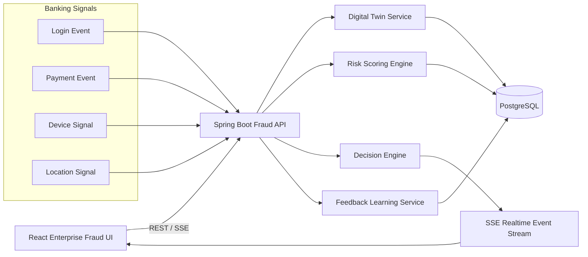
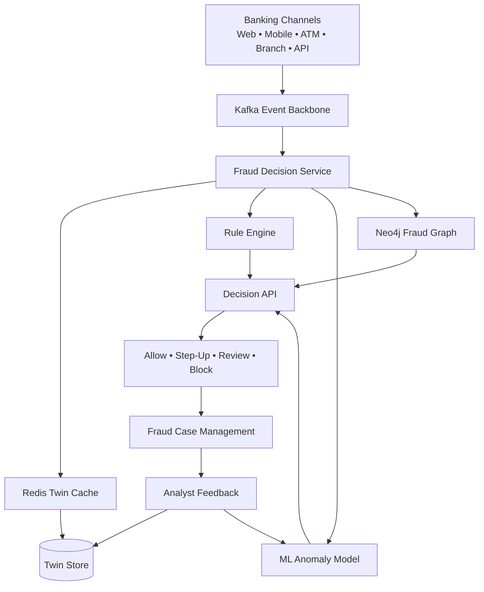

# 🛡️ Digital Identity Twin — Enterprise Fraud AI Platform

<p align="center">
  <strong>Real-time customer identity twin, explainable fraud scoring, and feedback learning loop for banking systems.</strong>
</p>

<p align="center">
  
  
  
  
  
</p>

---

## 🌟 What This Project Demonstrates

This repository is a **full-stack Digital Identity Twin fraud-detection POC** for banking. It shows how a bank can maintain a living digital representation of a customer identity and use it to evaluate login/payment behavior in real time.

The system answers one important question:

> **Does this activity match the customer's normal digital identity pattern?**

When an event arrives, the backend compares it against the customer twin and returns an explainable decision:

- ✅ `ALLOW`
- 🔐 `STEP_UP_AUTH`
- 🕵️ `MANUAL_REVIEW`
- ⛔ `BLOCK`

---

## 🧠 Digital Identity Twin Concept

A customer twin is a continuously updated behavioral profile containing:

| Twin Dimension | Examples |
|---|---|
| Identity | customer id, KYC status, profile metadata |
| Device | known devices, new device detection |
| Location | usual city/country, unusual location signals |
| Transaction Behavior | average amount, velocity, merchant habits |
| Trust | trust score, risk level, fraud history |
| Feedback | confirmed fraud, legitimate activity, false positives |

---

## 🏗️ High-Level Architecture



---

## ✨ Visual UI Capabilities

The React UI includes:

- Executive fraud dashboard
- Customer Digital Identity Twin cards
- Fraud event simulator
- Real-time decision stream using Server-Sent Events
- Risk explanation panel
- Event timeline
- Analyst feedback learning workflow
- Login page prepared for future Keycloak/OIDC integration

---

## ⚙️ Backend Capabilities

The Spring Boot backend includes:

- Digital twin profile APIs
- Fraud evaluation API
- Explainable rule-based scoring engine
- Feedback learning service
- PostgreSQL persistence
- Demo data seeding
- Trace ID filter for observability
- CORS configuration
- Swagger/OpenAPI
- Docker-ready packaging

---

## 🚀 Run Locally with Docker

### Prerequisites

- Docker Desktop
- Docker Compose

### Start the full stack

```bash
unzip digital-identity-twin-enterprise-app.zip
cd digital-identity-twin-enterprise
docker compose up --build
```

### Open the app

| Service | URL |
|---|---|
| UI | http://localhost:3000 |
| Backend | http://localhost:8080 |
| Swagger | http://localhost:8080/swagger-ui/index.html |
| Health | http://localhost:8080/actuator/health |
| PostgreSQL | localhost:5432 |

### Demo Login

```text
Username: admin
Password: admin
```

> The login page is UI-only for now and is structured so Keycloak/OIDC can be added later.

---

## 🧪 Demo Flow

1. Open the UI at `http://localhost:3000`.
2. Login using demo credentials.
3. Review dashboard metrics.
4. Select a customer twin.
5. Submit a transaction event.
6. Review the risk score and explainable reasons.
7. Watch the event appear in the real-time stream.
8. Submit analyst feedback.
9. Observe how the twin trust/risk profile changes.

---

## 🔌 API Overview

| Method | Endpoint | Purpose |
|---|---|---|
| `GET` | `/api/v1/dashboard` | Dashboard KPIs |
| `GET` | `/api/v1/twins` | List customer twins |
| `GET` | `/api/v1/twins/{customerId}` | Get one customer twin |
| `POST` | `/api/v1/twins` | Create a customer twin |
| `POST` | `/api/v1/fraud/evaluate` | Evaluate a login/payment event |
| `POST` | `/api/v1/fraud/feedback` | Submit analyst feedback |
| `GET` | `/api/v1/events/recent` | Recent fraud events |
| `GET` | `/api/v1/events/stream` | Real-time SSE decision stream |
| `GET` | `/api/v1/dataset/sample` | View synthetic sample data |

---

## 🧾 Sample Fraud Evaluation Request

```json
{
  "customerId": "CUST1001",
  "eventType": "PAYMENT",
  "amount": 2500.00,
  "merchant": "Unknown Crypto Exchange",
  "deviceId": "android-new-999",
  "location": "Lagos",
  "ipAddress": "102.88.10.44"
}
```

## ✅ Sample Response

```json
{
  "customerId": "CUST1001",
  "riskScore": 850,
  "decision": "BLOCK",
  "reasons": [
    "New device detected",
    "Unusual location detected",
    "Transaction amount is significantly above normal",
    "Unknown merchant detected",
    "High-risk merchant category detected"
  ]
}
```

---

## 🗂️ Repository Structure

```text
digital-identity-twin-enterprise
├── backend
│   ├── src/main/java/com/aegis/digitaltwin
│   │   ├── bootstrap
│   │   ├── config
│   │   ├── controller
│   │   ├── domain
│   │   ├── dto
│   │   ├── entity
│   │   ├── repository
│   │   └── service
│   ├── src/main/resources/application.yml
│   ├── Dockerfile
│   └── pom.xml
├── frontend
│   ├── src
│   │   ├── api
│   │   ├── main.jsx
│   │   └── styles.css
│   ├── Dockerfile
│   ├── nginx.conf
│   └── package.json
├── docs
│   ├── architecture.md
│   ├── api-examples.md
│   └── roadmap.md
├── compose.yaml
├── .gitignore
├── LICENSE
└── README.md
```

---

## 🧬 Dataset Strategy

This project uses **PaySim-inspired synthetic banking events** for local demo purposes. It does not bundle private, regulated, or real customer data.

For production or deeper experimentation, you can integrate:

- PaySim-style transaction simulation
- IEEE-CIS style transaction and identity features
- Internal bank event streams
- Device fingerprinting signals
- Fraud analyst feedback/case outcomes

---

## 🔐 Keycloak/OIDC Integration Roadmap

The UI login page is ready to be replaced with Keycloak/OIDC authentication.

Recommended next steps:

1. Add Keycloak container to `compose.yaml`.
2. Create realm: `digital-twin-fraud`.
3. Create client: `fraud-ui`.
4. Protect backend with Spring Security OAuth2 Resource Server.
5. Add role mapping:
   - `FRAUD_ANALYST`
   - `FRAUD_MANAGER`
   - `ADMIN`
6. Use JWT claims to control UI navigation and backend authorization.

---

## 🧭 Enterprise Roadmap

| Phase | Upgrade |
|---|---|
| Phase 1 | Rule-based scoring POC |
| Phase 2 | Kafka event ingestion |
| Phase 3 | Redis twin cache |
| Phase 4 | ML anomaly scoring |
| Phase 5 | Neo4j relationship fraud graph |
| Phase 6 | Keycloak security |
| Phase 7 | Case management workflow |
| Phase 8 | Model monitoring and drift detection |

---

## 🧩 Future Enterprise Architecture



---

## 📌 Why This Repo Is Useful

This project is useful for:

- Banking fraud architecture demos
- AI/ML fraud platform portfolio work
- Spring Boot + React full-stack showcase
- Digital twin proof of concept
- Real-time decisioning demo
- LinkedIn technical post or interview discussion

---

## ⚠️ Disclaimer

This is a proof-of-concept application using synthetic data and simplified rules. It is not production fraud infrastructure. A production system would require stronger controls around privacy, model governance, auditability, explainability, bias testing, security, monitoring, and regulatory compliance.

---

## 📸 Suggested Screenshot Slots

After running the app, capture screenshots and place them under `assets/`:

```text
assets/dashboard.png
assets/customer-twin.png
assets/fraud-evaluation.png
assets/risk-explanation.png
assets/realtime-stream.png
```

Then update this README with:

```markdown

```

---

## ⭐ Suggested GitHub Repo Name

```text
digital-identity-twin-fraud-ai
```

## Suggested GitHub Description

```text
Enterprise Digital Identity Twin fraud detection POC using Spring Boot, React, PostgreSQL, Docker, realtime SSE, and explainable risk scoring.
```
