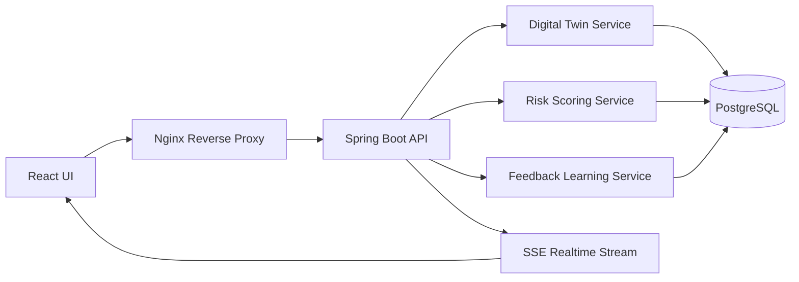

# Architecture

## Current POC

## Decisioning Pattern

1. Event arrives from UI/API.
2. Customer twin is loaded.
3. Risk scoring compares activity against normal behavior.
4. Decision engine maps score to action.
5. Event is persisted.
6. SSE pushes the result to UI.
7. Analyst feedback updates the twin.
